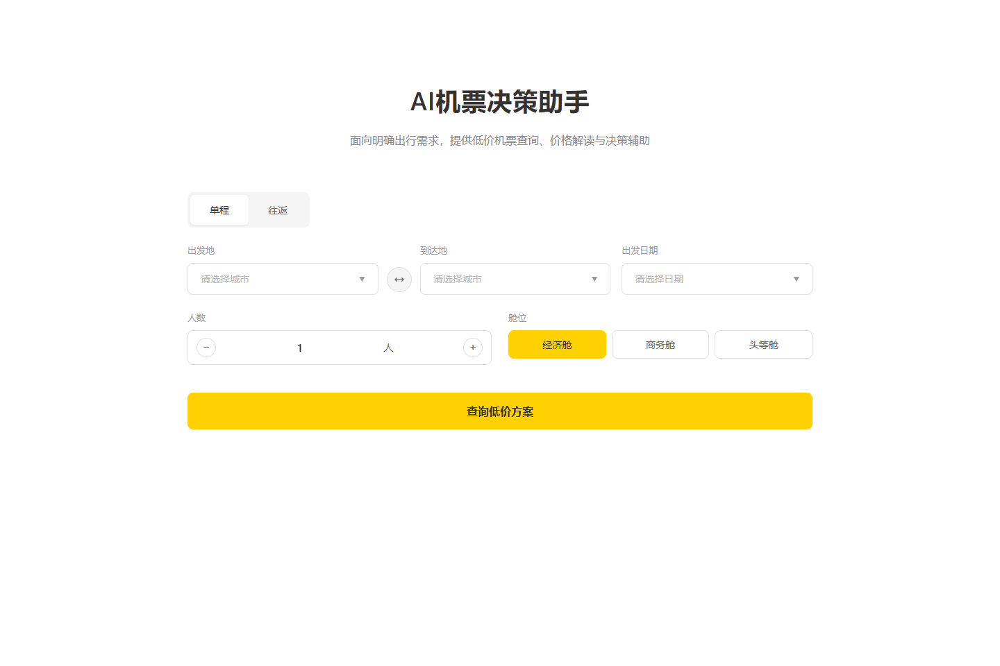
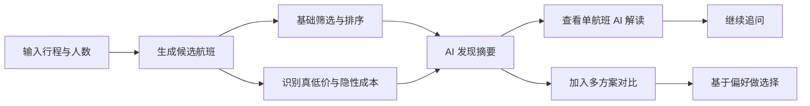
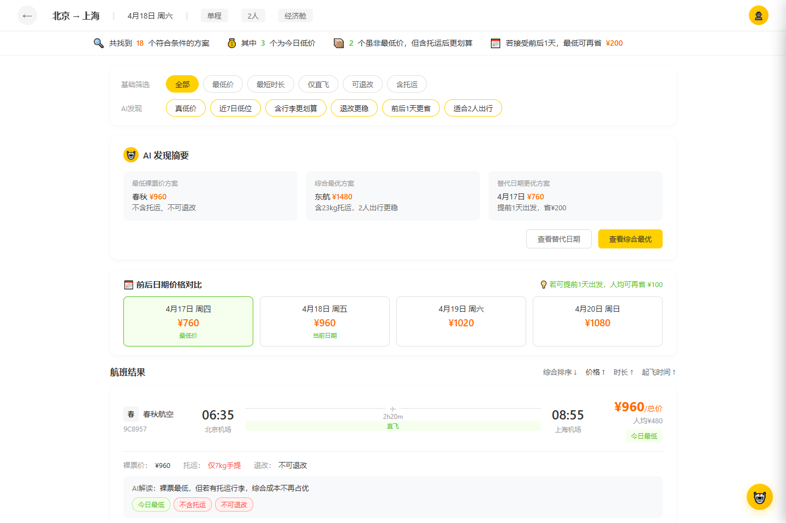
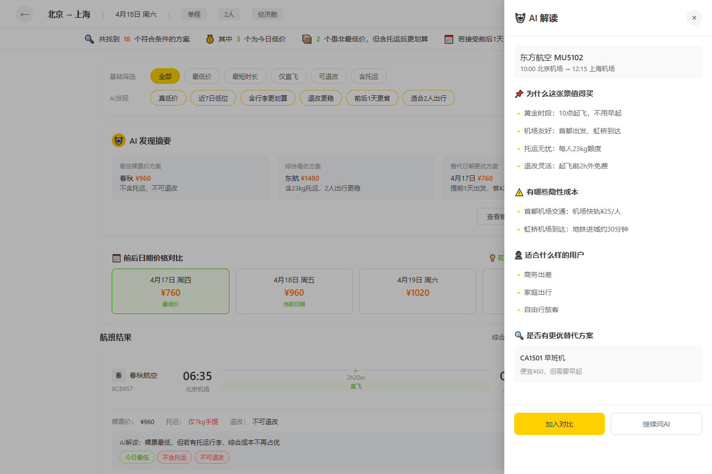
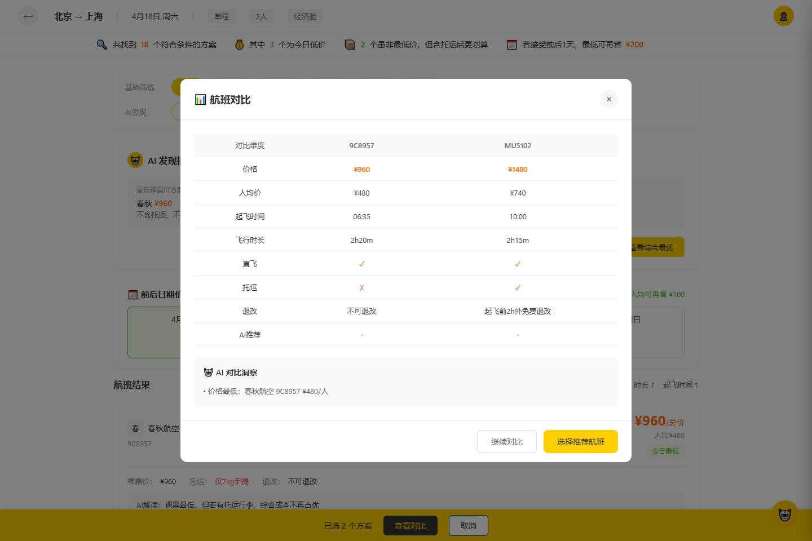

# AI 机票决策助手

> An interactive flight-decision prototype that turns price, baggage, refund rules, timing, and user preferences into explainable recommendations.

一个面向机票比价场景的 AI 产品交互原型。它不只展示“最低价”，而是把托运行李、退改规则、出发时间、机场成本与同行人数放进同一条决策链，帮助用户理解为什么某个方案更适合自己。

**项目状态：可交互静态原型｜模拟数据｜在线演示准备中**



## 用户问题

传统机票列表擅长排序，却经常把真正影响决策的信息拆散在多个位置：

- 票面价格最低，不一定包含托运行李或可退改权益
- 不同机场、起飞时间和地面交通会产生额外成本
- 多人出行时，用户关心的是总价、人均价与同行便利性
- 用户很难快速回答“便宜多少值得换机场或早起”

这个原型把“查票”重新组织为“理解约束—比较方案—解释取舍—完成选择”。

## 产品流程



## 核心体验

| 能力 | 设计意图 |
| --- | --- |
| 行程输入 | 支持单程/往返、城市、日期、人数与舱位条件 |
| 多维筛选 | 将最低价、最短时长、直飞、退改、托运等条件显式化 |
| AI 发现摘要 | 同时给出最低票面价、综合最优和替代日期方案 |
| 解释型推荐 | 说明值得买的原因、隐性成本、适合人群和替代选择 |
| 航班对比 | 统一比较价格、时长、直飞、托运、退改和推荐结果 |
| 追问入口 | 使用预置问题和自由输入延伸用户决策 |

## 界面预览

### 1. 从行程约束开始


### 2. 把价格和隐性成本放在同一页面



### 3. 让推荐有解释



### 4. 将取舍落到可比较的维度



以上截图均由仓库中的真实页面生成。

## 关键产品取舍

- **先解释，再推荐**：AI 不直接替用户下结论，而是展示收益、隐性成本与适用人群。
- **区分票面低价与综合低价**：把托运、退改、机场交通等因素纳入展示。
- **保留用户控制权**：筛选、排序、查看解读、加入对比均由用户主动触发。
- **先验证交互，再接真实数据**：当前用静态数据验证信息架构与决策路径，没有伪装成真实票务系统。

## 本地体验

仓库没有构建步骤，可直接打开 `index.html`。也可以在仓库目录启动一个静态服务器：

```bash
python -m http.server 8000
```

然后访问：

```text
http://localhost:8000
```

## 项目结构

```text
meituan-html-demo/
├── index.html          # 页面结构、样式、模拟数据与交互逻辑
└── docs/images/        # README 使用的真实页面截图
```

## 当前边界

- 航班、价格、日期和 AI 回复均为模拟数据。
- 不连接航司、OTA、支付或真实购票接口。
- 不提供账号体系、订单管理和生产级异常处理。
- 在线演示正在准备中，当前不提供无效占位链接。

## 后续方向

- 接入可替换的数据适配层，区分搜索、推荐和解释服务
- 用用户偏好与约束生成可追溯的推荐理由
- 增加价格波动、替代机场和总行程成本视图
- 建立推荐质量与解释有效性的用户评估指标

## 使用说明

本仓库目前用于个人作品展示与产品原型交流，未附开源许可证。
